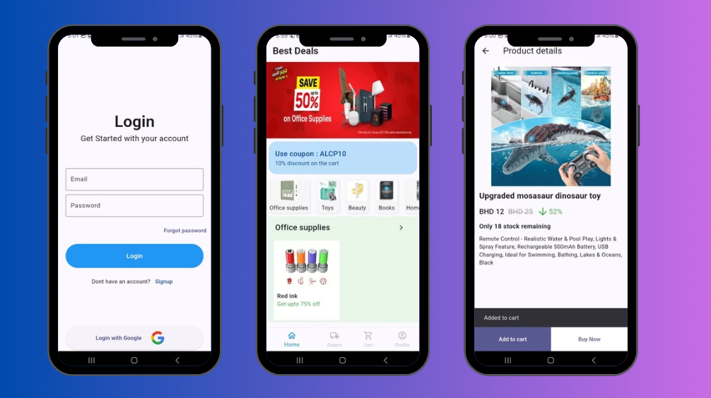
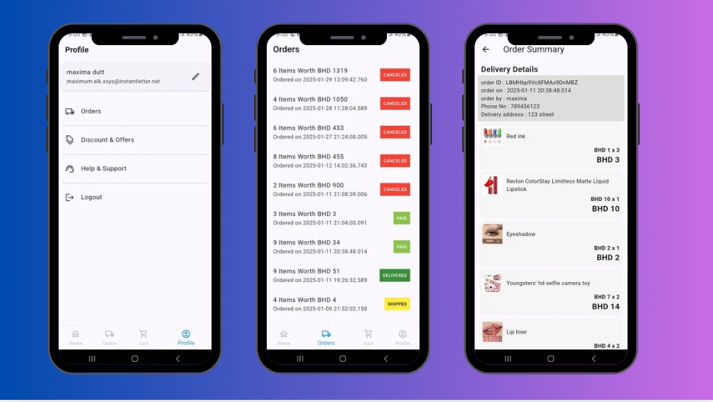
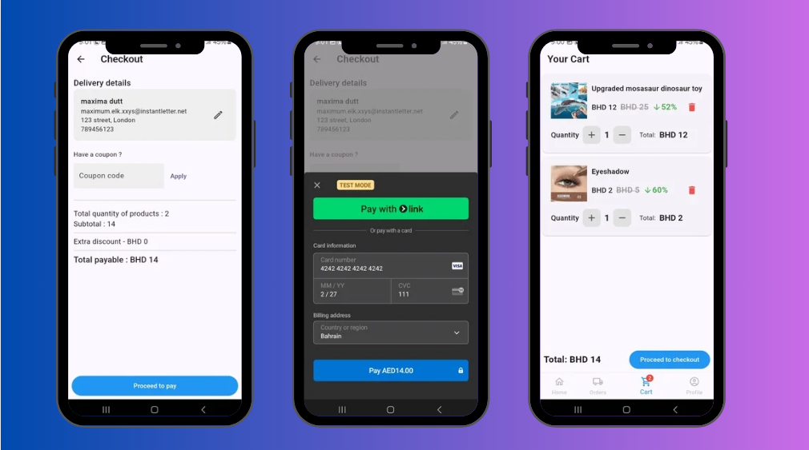

# Shoporia

Shoporia is a Flutter-based e-commerce app designed for a seamless shopping experience. The app allows users to browse and purchase a wide range of products, manage their shopping cart, and securely checkout.








## Features

- **Browse Products**: Users can view a variety of products categorized for easy browsing.
- **Product Search**: A search feature that allows users to find specific products.
- **Shopping Cart**: Add items to the shopping cart, view cart details, and modify quantities.
- **User Authentication**: Sign up and login functionality.
- **Secure Checkout**: Users can complete purchases with secure payment options.

## Installation

### Prerequisites

- Install **Flutter**: Make sure Flutter is installed on your machine. Follow the installation guide here: [Flutter Installation](https://flutter.dev/docs/get-started/install).
- Install **Dart**: Dart is automatically installed with Flutter.

### Steps to Run

1. Clone the repository:
   ```bash
   git clone https://github.com/afham-haleema/shoporia.git

2. Navigate to the project directory:
   ```bash
   cd shoporia

3. flutter pub get

4. flutter run

## Technologies Used

- **Flutter**: The app is built using Flutter for cross-platform development.
- **Dart**: The programming language used in Flutter.
- **Firebase**: Used for authentication and backend services

## Contributing

Feel free to fork this project, submit issues, and send pull requests. Contributions are always welcome!


## Acknowledgements

- Thanks to **Flutter** and the Flutter community for their amazing tools and resources.
- Special thanks to the libraries used in the development of this app.

